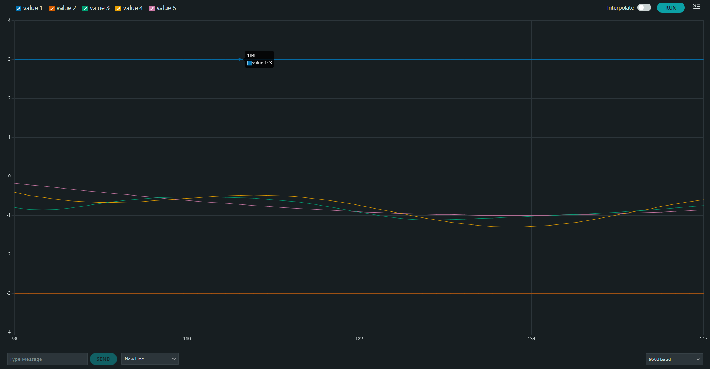
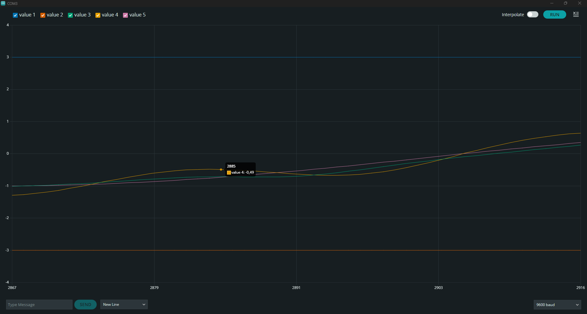

# Filtro alta frecuencia Arduino

## Descripción

Mediante una red Adaline se filtra una señal senoidal con ruido.

## Capturas de pantalla

*El desacoplamiento es alto, progresivamente mejora*

*La señal de salida se va acoplando a la señal seno original*

